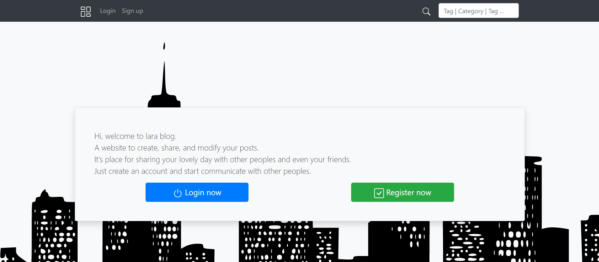
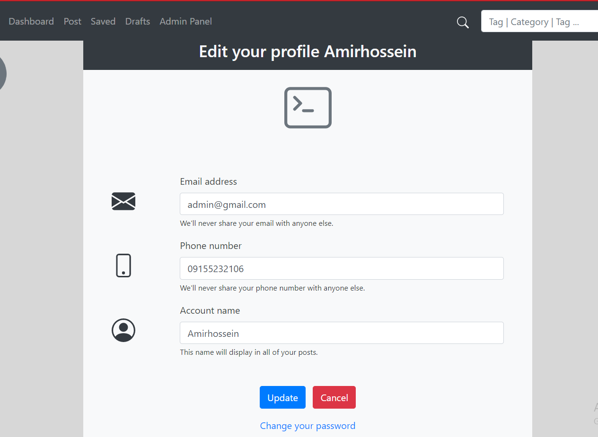
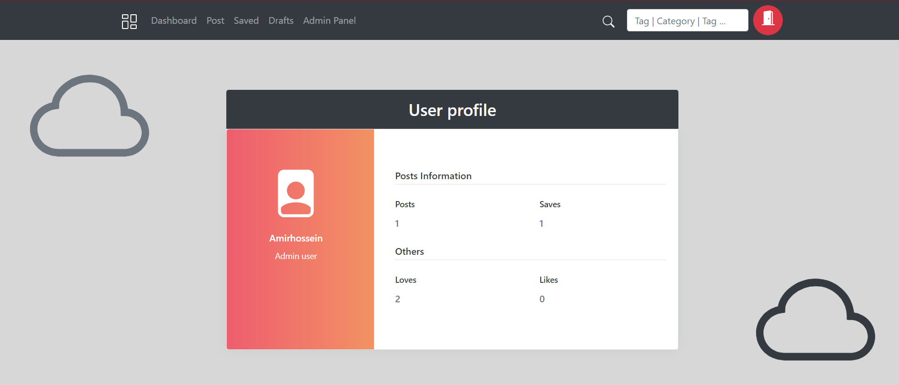
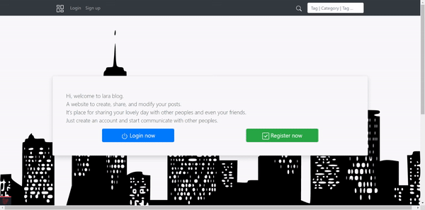
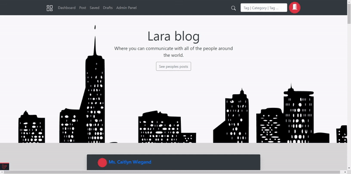
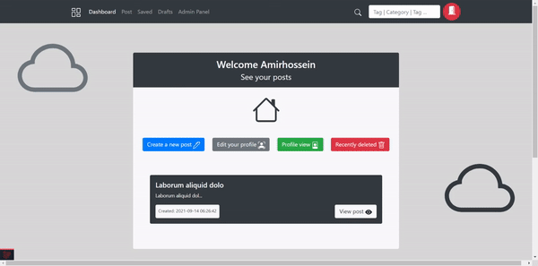
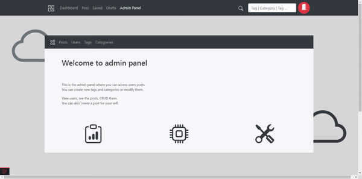

# Lara Blog

    
    
    
    

### Welcome

### Main page

### Post

### Admin panel

Creating a blog website with Laravel and Blade.

Read the <a href="./documents/README.md">documentation</a>.
