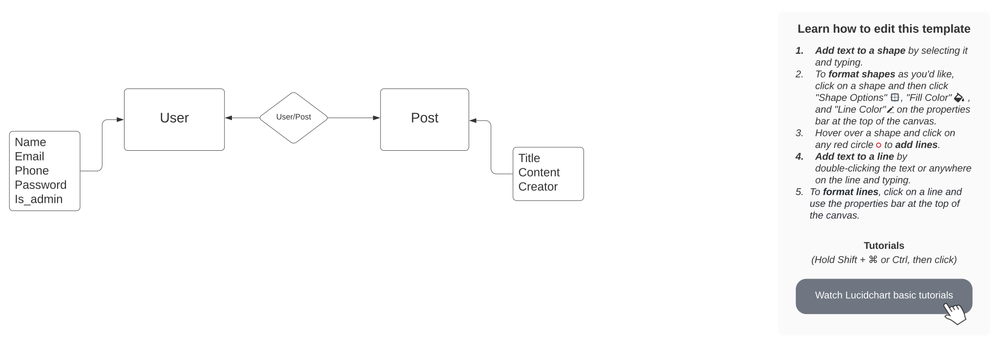

# Database models 
This is the schema of our project database.

## Models 
List of all our models and their attributes.
- User 
    - Name 
    - Email 
    - Phone
    - Password
    - IsAdmin
- Post 
    - Title 
    - Content 
    - Creator
    
## Relations 
List of all relations between models.
- User and Post
    - User can create many posts
    - Each post belongs to one user
    - User can have no posts 
    - Post must have a user
  
## Visual
